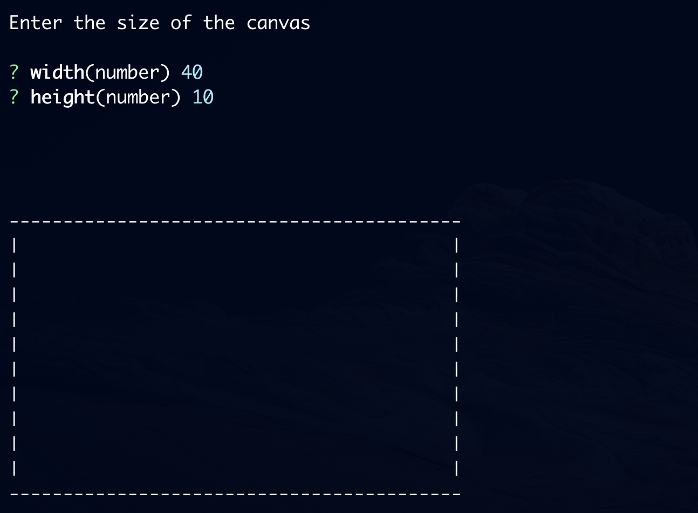
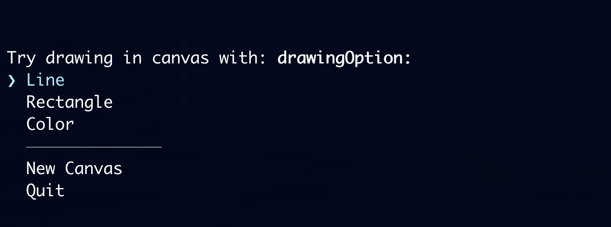
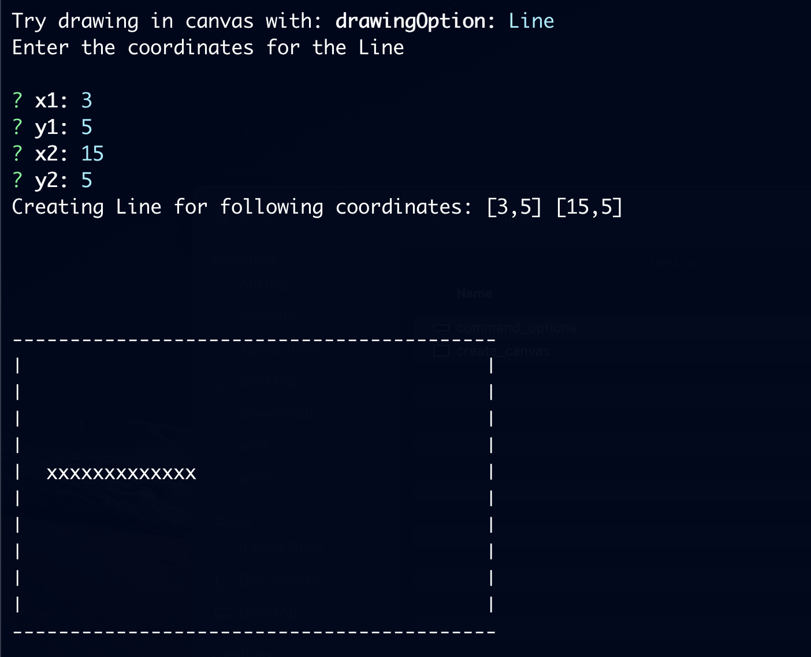
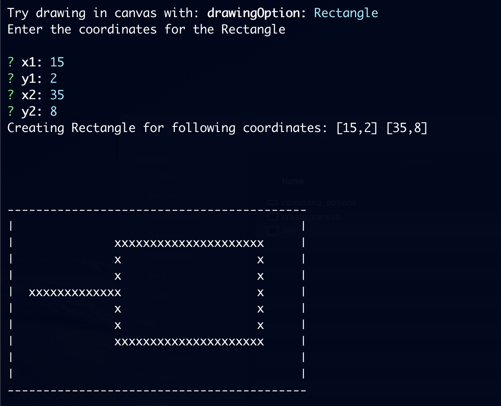
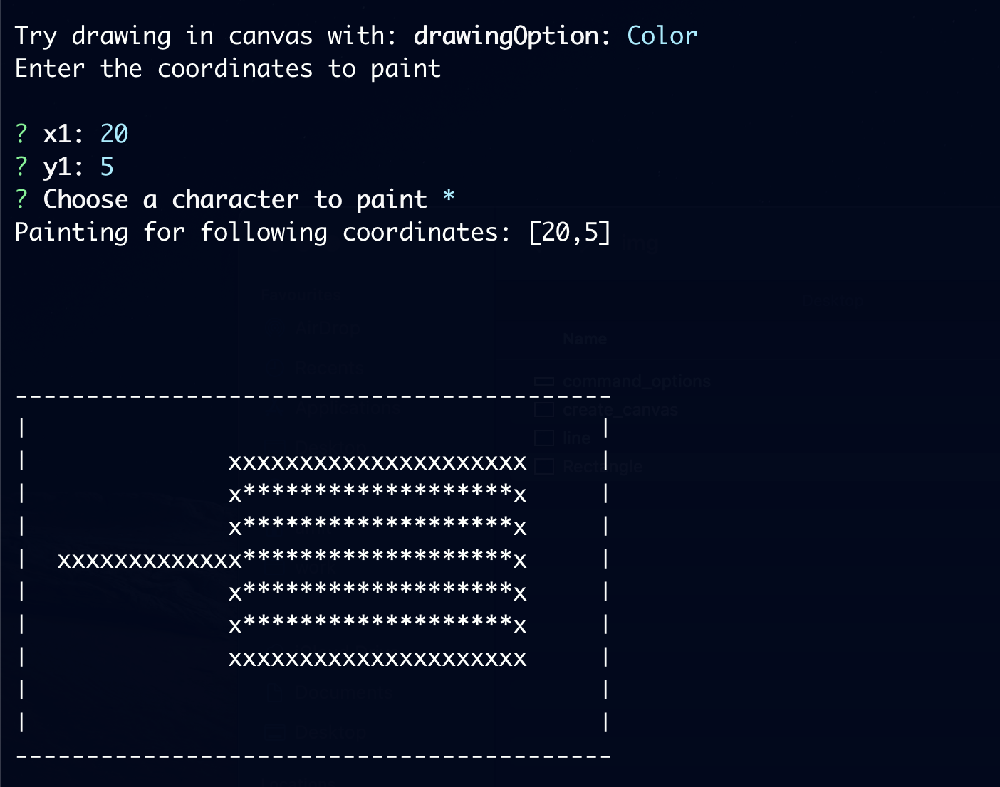
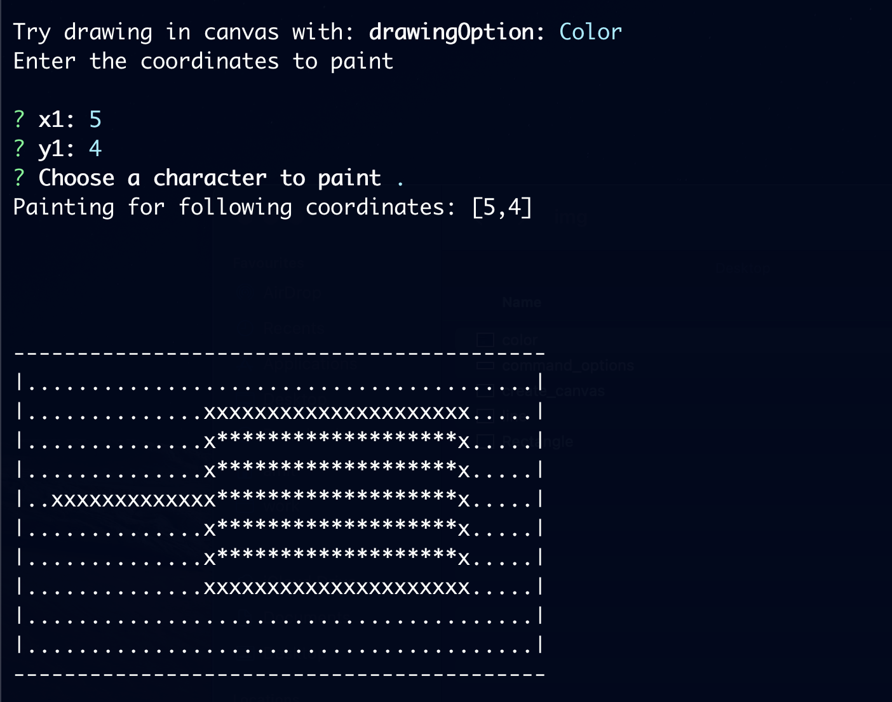

# NodeJs CLI Paint
A basic Typescript base solution to provide paint-like features through command line. 

# Content
- [Features](#features)
- [Get Started](#get-started)

## Features 
### Create Canvas

Enter the `height` and `with` of the canvas to create a virtual canvas like this.

### Drawing Options

The following options will be given are available to play around.
You can re-create `new canvas` or `quit` seamlessly. 

### Line

With the given coordinates of `x1`, `y1` as starting point, `x2`, `y2` as end, the line will be plotted inside the canvas accordingly.

### Rectangle

Similar to the line coordinates, the rectangle will be plotted from top left corner (`x1`, `y1`) to bottom right corner (`x2`, `y2`).

### Color

Now! we won't have "real colors" here but we can choose a characters to paint it. I chose `*`.

The `x1` and `y1` coordinates will decide which section will be painted. The behavior is similar as any other painting application. It respects the borders and does not overflows the color. 

**Let's try one more time**


This time the chosen coordinates were outside the drawing area. 

# Get Started
## Installation
```
npm i
```
## Start
```
npm start
```
## Test
```
npm test
```

